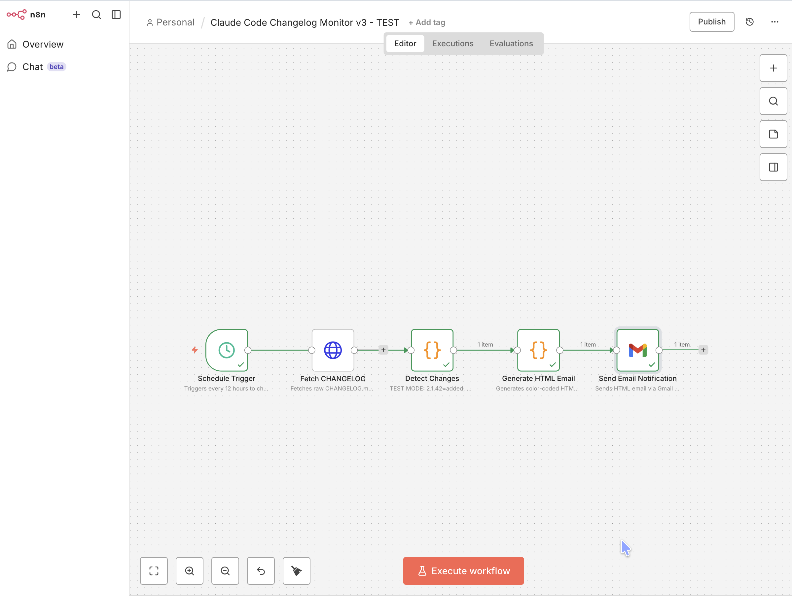
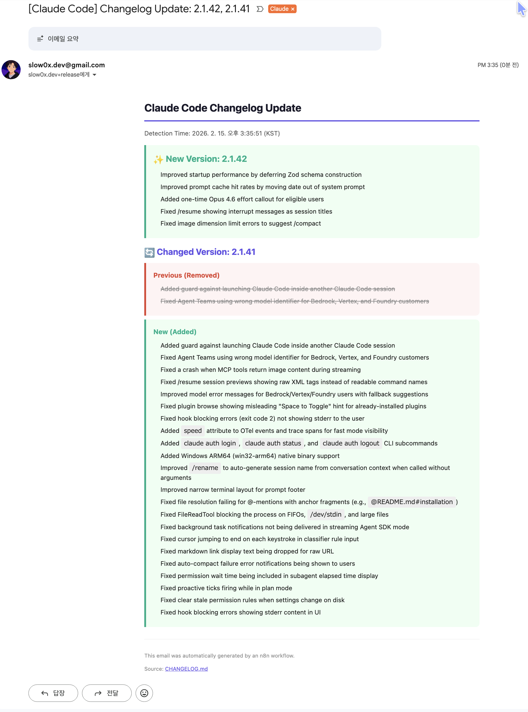

# Claude Code Changelog Monitor

[Claude Code](https://github.com/anthropics/claude-code)의 CHANGELOG.md를 12시간 간격으로 자동 모니터링하여, 버전별 변경 사항을 감지하고 색상 코딩된 HTML 이메일로 알림을 보내는 n8n 워크플로우입니다.

## 주요 기능

- **12시간 자동 모니터링** - Schedule Trigger로 CHANGELOG.md 변경 감지
- **버전 단위 diff** - 새 버전 추가, 기존 버전 내용 변경, 버전 삭제를 구분
- **색상 코딩 HTML 이메일** - 추가(초록), 삭제(빨강), 변경(보라) 시각적 구분
- **ETag 최적화** - GitHub ETag 헤더 비교로 변경 없을 시 빠른 종료
- **Terraform IaC** - `terraform apply` 한 번으로 AWS EC2 + n8n 자동 배포

## Workflow Architecture

```
Schedule Trigger (12h) → Fetch CHANGELOG (HTTP) → Detect Changes (Code)
  → Generate HTML Email (Code) → Send Email (Gmail OAuth2)
```

### n8n Workflow Editor



### 노드 설명

| 노드 | 타입 | 역할 |
|------|------|------|
| **Schedule Trigger** | Schedule | 12시간마다 워크플로우 실행 |
| **Fetch CHANGELOG** | HTTP Request | GitHub에서 CHANGELOG.md 원본 + ETag 헤더 가져오기 |
| **Detect Changes** | Code | `staticData`로 이전 내용과 비교, 버전별 diff 분류 |
| **Generate HTML Email** | Code | 변경 내용을 색상 코딩된 HTML 이메일로 생성 |
| **Send Email Notification** | Gmail | Gmail OAuth2 API로 이메일 발송 |

### 변경 감지 로직

1. **첫 실행** - 현재 CHANGELOG 내용을 baseline으로 저장, 이메일 미발송 (false positive 방지)
2. **ETag 비교** - 이전 실행과 동일하면 즉시 종료 (불필요한 파싱 방지)
3. **Line-by-line 버전 파싱** - `## x.y.z` 헤더를 기준으로 버전 섹션 분리
4. **Diff 분류** - 새 버전(added), 내용 변경(changed), 버전 삭제(removed) 감지
5. **변경 있을 때만** 다음 노드로 데이터 전달 (없으면 `return []`로 flow 중단)

## 테스트 결과

v2.1.42 (신규 버전)와 v2.1.41 (내용 변경) 데이터로 테스트한 이메일 결과:



- **New Version (초록)** - 새로 추가된 버전의 변경 내역
- **Changed Version (보라)** - 기존 버전에서 변경된 내용을 Previous(빨강, 취소선) / New(초록)로 비교 표시
- 이메일 하단에 CHANGELOG.md 원본 링크 포함

## 빠른 시작

### 1. 인프라 배포 (Terraform)

```bash
cd infra
cp terraform.tfvars.example terraform.tfvars
# terraform.tfvars 편집: aws_region, key_pair_name, allowed_cidr 설정
terraform init
terraform plan
terraform apply
```

배포 완료 후 output에 `n8n_url`, `ssh_command`가 표시됩니다.

### 2. n8n 초기 설정

1. `http://<EIP>:5678` 접속 -> Owner 계정 생성
2. **Gmail OAuth2 Credential 설정**:
   - [Google Cloud Console](https://console.cloud.google.com/)에서 OAuth 2.0 Client ID 생성
   - Redirect URI: `http://localhost:5678/rest/oauth2-credential/callback`
   - SSH 터널 연결: `ssh -N -L 5678:localhost:5678 -i infra/<key>.pem ec2-user@<EIP>`
   - n8n Credentials > New > Gmail OAuth2에서 Client ID/Secret 입력 후 연결

### 3. 워크플로우 Import

1. n8n 에디터에서 `...` 메뉴 > `Import from File`
2. `workflows/changelog-monitor-v3.json` 업로드
3. **Send Email Notification** 노드에서 Gmail OAuth2 Credential 연결
4. 수신 이메일 주소 수정 (기본값: `slow0x.dev+release@gmail.com`)
5. 우측 상단 토글을 **Active**로 변경

> **참고**: 첫 실행 시 현재 CHANGELOG 내용을 baseline으로 저장하고 이메일은 발송하지 않습니다. 이후 실제 변경이 감지될 때부터 이메일이 발송됩니다.

## 프로젝트 구조

```
├── workflows/
│   ├── changelog-monitor-v3.json   # 현재 활성 워크플로우
│   ├── changelog-monitor-v2.json   # v2 레거시 (참조용)
│   └── changelog-monitor.json      # v1 레거시 (참조용)
├── infra/
│   ├── main.tf                     # EC2, Security Group, EIP, SSH 키 자동 생성
│   ├── variables.tf                # 입력 변수 정의
│   ├── outputs.tf                  # 배포 결과 출력
│   ├── terraform.tfvars.example    # 변수 템플릿
│   ├── scripts/
│   │   └── user-data.sh            # EC2 초기화 (Docker, Swap, n8n)
│   └── templates/
│       ├── docker-compose.yml.tpl  # Docker Compose 템플릿
│       └── .env.tpl                # n8n 환경변수 템플릿
├── docs/
│   ├── sop.md                      # 수동 배포 SOP
│   └── images/                     # README 스크린샷
└── CLAUDE.md                       # Claude Code 개발 가이드
```

## 인프라 구성

| 리소스 | 스펙 |
|--------|------|
| EC2 Instance | Amazon Linux 2023, t2.micro (Free Tier) |
| Storage | 30GB gp3 (Free Tier 최대) |
| Swap | 2GB (t2.micro 메모리 보완) |
| Container | Docker + Docker Compose로 n8n 실행 |
| Network | Elastic IP + Security Group (SSH, n8n 포트) |

## 버전 히스토리

| 버전 | 주요 변경 |
|------|-----------|
| **v3** | `neverError` HTTP 에러 처리, HTTP status code 검증, line-by-line 버전 파서, Gmail OAuth2 |
| **v2** | 번역 API 실패 시 graceful degradation, HTTP 타임아웃, 입력 유효성 검사 |
| **v1** | 초기 구현 (SMTP, 정규식 파서) |

## 필요 Credential

| Credential | 용도 | 설정 위치 |
|------------|------|-----------|
| Gmail OAuth2 | 이메일 발송 | n8n UI > Credentials |

## License

MIT
